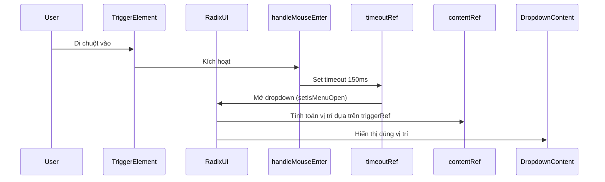

Giải thích chính xác về `triggerRef` trong Navbar component:

1. **Mục đích chính**: 
- `triggerRef` (dòng 19, 106-107) được dùng để tham chiếu trực tiếp tới phần tử DOM của nút trigger dropdown menu "Men", phục vụ 3 mục đích chính:
  + Tích hợp với thư viện Radix UI để xử lý positioning dropdown
  + Quản lý focus state cho accessibility
  + Làm anchor point cho dropdown content positioning

2. **Cách hoạt động chi tiết**:
```typescript
// Khởi tạo ref (dòng 19)
const triggerRef = useRef<HTMLDivElement>(null)

// Gán ref vào phần tử trigger (dòng 106-107)
<NavigationMenuItem 
  ref={triggerRef}
  // ... các props khác
>
```

3. **Tương tác với các thành phần khác**:
- Kết hợp với `contentRef` (dòng 20, 128) để tính toán vị trí hiển thị dropdown
- Phối hợp với `timeoutRef` (dòng 18) để quản lý delay hover
- Liên kết với state `isMenuOpen` (dòng 16) để điều khiển hiển thị

4. **Flow hoạt động khi hover**:


5. **Vai trò trong accessibility**:
- Quản lý focus state qua các props:
  ```jsx
  onFocus={() => setIsMenuOpen(true)}
  onBlur={() => setIsMenuOpen(false)}
  aria-haspopup="true"
  aria-expanded={isMenuOpen}
  ```
- Cho phép điều hướng bằng bàn phím qua `handleKeyDown`